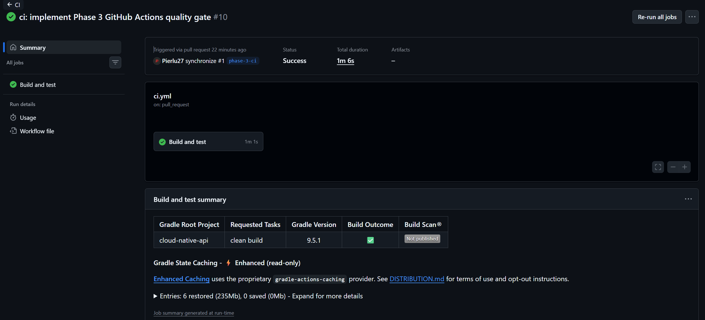
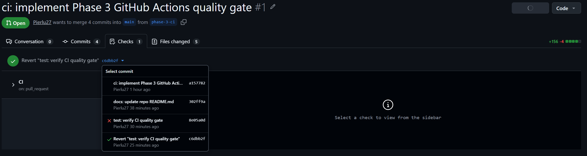

# Phase 3 verification evidence

## Local verification

Run the CI-equivalent command with Docker available for Testcontainers:

```bash
./gradlew clean build --no-daemon
```

Expected result: compilation, unit tests, and PostgreSQL-backed integration
tests pass.

The command completed successfully locally, including the PostgreSQL-backed
integration tests executed through Testcontainers.

## GitHub Actions verification

The Phase 3 GitHub Actions workflow was verified through pull request `#1`,
from the `phase-3-ci` branch to `main`.

The workflow is triggered by the `pull_request` event and executes the
`Build and test` job. The workflow run pages confirm that the executions were
triggered by the pull request and that the workflow was executed on the
`phase-3-ci` branch. ([GitHub][2])

### Successful runs

Two successful workflow runs were recorded:

* Run 1: 1m 11s total, with `Build and test` taking 1m 07s.
* Run 2: 1m 01s total, with `Build and test` taking 58s.

Both workflow runs completed successfully. ([GitHub][2])

Run 2 completed 10 seconds faster than Run 1. The `Set up Gradle` logs also
confirm that Gradle state was restored from cache. This provides observed
evidence of a faster subsequent run with the Gradle cache active, while
GitHub-hosted runner timing can still vary.

### Gradle cache

The `Set up Gradle` step reported the use of the enhanced caching mechanism:

```text
Enhanced Caching: This build is using the proprietary
'gradle-actions-caching' provider for optimized caching support.

Restore Gradle state from cache

All Gradle Wrapper jars are valid
```

This confirms that the configured Gradle caching mechanism was active and
that Gradle state was restored from the cache.

The Gradle Wrapper JARs were also validated successfully.



*Figure 1. Successful pull-request run with the `Build and test` job and 235 MB of Gradle state restored from cache.*

### Quality gate verification

The integration test `contextLoads()` was temporarily modified to fail
intentionally:

```java
@Test
void contextLoads() {
    fail("Intentional failure to verify the Phase 3 CI quality gate");
}
```

The resulting GitHub Actions execution failed during the `Build and test`
job. The job reports:

```text
Build, unit tests, and integration tests
Process completed with exit code 1
```

This demonstrates that a failing integration test causes the `Build and test`
job to fail. ([GitHub][1])

The intentionally failing change was then reverted using:

```bash
git revert HEAD
git push
```

The subsequent workflow execution completed successfully:

* Total duration: 1m 06s
* `Build and test`: 1m 01s
* Result: success ([GitHub][3])

This confirms that the CI quality gate detects a failing test and returns to
a passing state after the faulty change is reverted.

## Workflow runs

### Run 1 — successful

* Result: success
* Total duration: 1m 11s
* `Build and test`: 1m 07s
* Trigger: pull request
* Branch: `phase-3-ci`

[https://github.com/Pierlu27/cloud-native-api/actions/runs/32040483264](https://github.com/Pierlu27/cloud-native-api/actions/runs/32040483264)

### Run 2 — successful

* Result: success
* Total duration: 1m 01s
* `Build and test`: 58s
* Trigger: pull request
* Branch: `phase-3-ci`

[https://github.com/Pierlu27/cloud-native-api/actions/runs/32040880793](https://github.com/Pierlu27/cloud-native-api/actions/runs/32040880793)

### Run 3 — intentional test failure

* Result: failure
* Total duration: 1m 16s
* `Build and test`: 1m 11s
* Trigger: pull request
* Branch: `phase-3-ci`
* Cause: intentionally failing integration test
* Job result: `Process completed with exit code 1`

[https://github.com/Pierlu27/cloud-native-api/actions/runs/32041304939](https://github.com/Pierlu27/cloud-native-api/actions/runs/32041304939)

Direct job evidence:

[https://github.com/Pierlu27/cloud-native-api/actions/runs/32041304939/job/95421379293](https://github.com/Pierlu27/cloud-native-api/actions/runs/32041304939/job/95421379293)

### Run 4 — successful after revert

* Result: success
* Total duration: 1m 06s
* `Build and test`: 1m 01s
* Trigger: pull request
* Branch: `phase-3-ci`

[https://github.com/Pierlu27/cloud-native-api/actions/runs/32041779061](https://github.com/Pierlu27/cloud-native-api/actions/runs/32041779061)

## Pull request evidence

The workflow was executed through pull request `#1` from `phase-3-ci`
to `main`.



*Figure 2. Pull request #1 checks: the deliberately failing test is marked as failed and the revert is marked as successful.*

The workflow run pages confirm that the workflow is configured with
`pull_request` as its trigger. ([GitHub][2])

## Verification summary

The Phase 3 CI workflow was verified both locally and through GitHub Actions.

The workflow successfully:

* compiles the project;
* executes the configured tests;
* executes PostgreSQL-backed integration tests through Testcontainers;
* configures Gradle through the GitHub Actions Gradle setup action;
* restores Gradle state through the configured cache;
* reports a successful status when the build and tests pass;
* reports a failed status when an integration test is intentionally broken;
* returns to a successful status after the faulty change is reverted;
* runs automatically for the `pull_request` event targeting `main`.

The verification was performed on the dedicated `phase-3-ci` branch without
directly modifying `main`.

The intentionally failing test demonstrated the quality-gate behavior:
the `Build and test` job failed with exit code 1, and after reverting the
faulty change the following workflow execution returned to a successful
state. ([GitHub][1])

## Evidence summary

| Evidence                                  | Result                            |
| ----------------------------------------- | --------------------------------- |
| Local `./gradlew clean build --no-daemon` | Success                           |
| GitHub Actions successful run             | Run 1 — 1m 11s                    |
| GitHub Actions subsequent successful run  | Run 2 — 1m 01s                    |
| Gradle cache restoration                  | Confirmed in `Set up Gradle` logs |
| Intentional integration-test failure      | Run 3 — failed                    |
| Quality-gate job result                   | `Build and test` — exit code 1    |
| Reverted test                             | `git revert HEAD`                 |
| Post-revert workflow                      | Run 4 — success, 1m 06s           |
| Pull request                              | `#1`, `phase-3-ci` → `main`       |
| Pull-request status screenshot            | Figure 2                          |
| Gradle cache screenshot                   | Figure 1                          |

[1]: https://github.com/Pierlu27/cloud-native-api/actions/runs/32041304939/job/95421379293 "ci: implement Phase 3 GitHub Actions quality gate · Pierlu27/cloud-native-api@8e05a0d · GitHub"
[2]: https://github.com/Pierlu27/cloud-native-api/actions/runs/32040483264 "ci: implement Phase 3 GitHub Actions quality gate · Pierlu27/cloud-native-api@a157782 · GitHub"
[3]: https://github.com/Pierlu27/cloud-native-api/actions/runs/32041779061 "ci: implement Phase 3 GitHub Actions quality gate · Pierlu27/cloud-native-api@c6dbb2f · GitHub"
